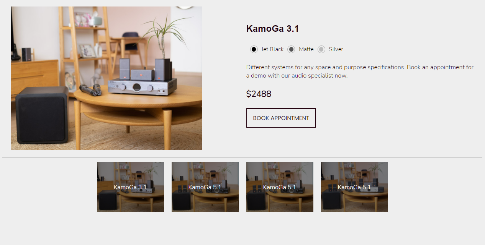
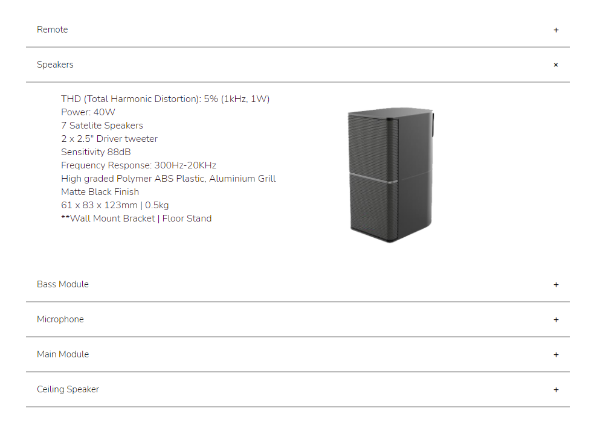
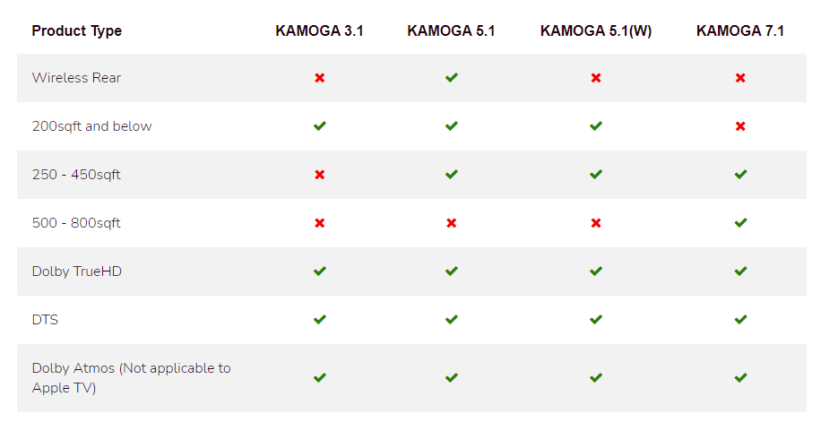

# Kamoga - Snippets of code for Ecommerce Sites
A part of a Ecommerce Website done for The Cosy Paws, this source code is for 3 components as listed below.<br>
Feel free to use this as a template for your projects.
- Comparison Table
- DropDown (can be used for FAQs)
- Display price and product desription section

## About Project
Source Code: https://github.com/jolenechong/kamogaEcommerceSnippets <br>
Products Component was designed to showcase multiple versions of the same product for easy comparison.<br>
<br>
Seamless dropdown section whcih can be used to show add-ons to main products or FAQs.<br>
<br>
Simple Comparision Tabel for Products<br>
<br>

## Built with
- HTML/CSS
- Javascript

## Getting started
1. Clone Repo
```git clone https://github.com/jolenechong/TheCosyPaws.git```
2. Edit the images and descriptions in the HTML file respectively

## License
Distributed under the MIT License. See `LICENSE` for more information.


## Contact
Jolene - [jolenechong7@gmail.com](mailto:jolenechong7@gmail.com) <br>
Project Link: https://github.com/jolenechong/shoppingCart-javascript
